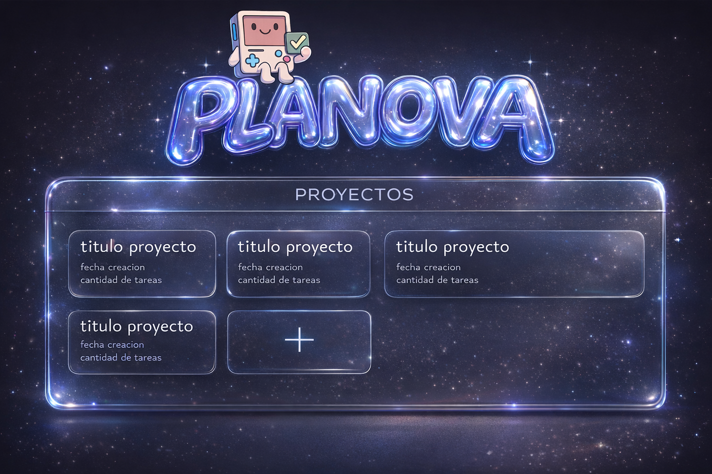
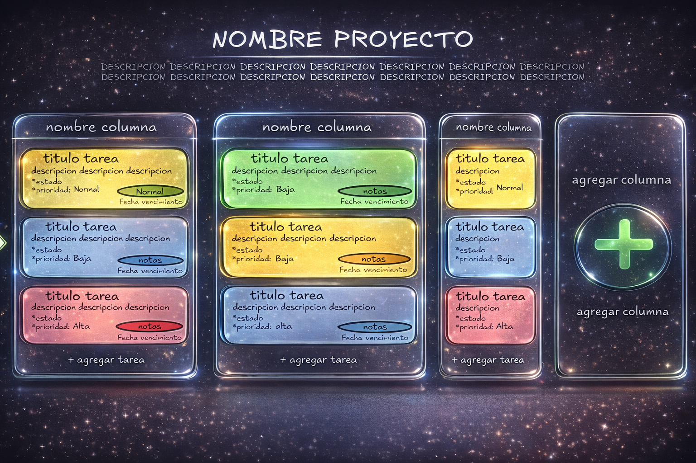

<p align="center">
  
</p>

<h1 align="center">PLANʘVA</h1>

<p align="center">
  <strong>Organiza tu universo de tareas con estilo.</strong><br>
  Una plataforma Kanban moderna diseñada para fluir.
</p>

<p align="center">
  
  
  
  
  
</p>

---

## ✨ Características Principales

*   **Tablero Kanban Interactivo:** Arrastra y solta tareas entre columnas con una experiencia fluida gracias a `@dnd-kit`.
*   **Estética Glassmorphism:** Interfaz visual moderna con desenfoques, transparencias y gradientes premium.
*   **Seguridad de Hierro:** Autenticación vía JWT con validación de propiedad (Ownership) estricta en cada petición.
*   **Gestión de Tareas Inteligente:** Prioridades, fechas de vencimiento y auto-vencimiento automático.
*   **Totalmente Responsive:** Diseñado para verse bien en cualquier dispositivo.

<p align="center">
  
</p>

---

## 🚀 Guía de Inicio Rápido

### Requisitos Previos
- Java 17+
- Node.js 18+
- MySQL 8+
- Maven

### 1. Clonar el repositorio e instalar dependencias
```bash
git clone https://github.com/tu-usuario/planova.git
cd planova
```

### 2. Configuración del Backend
Dirígete a la carpeta `Planova-BACKEND/` y crea un archivo `.env` basado en `.env.example`:
```env
DB_URL=jdbc:mysql://localhost:3306/planova_db
DB_USERNAME=tu_usuario
DB_PASSWORD=tu_password
JWT_SECRET=una_clave_secreta_muy_larga_y_segura
```
Luego ejecuta:
```bash
mvn spring-boot:run
```

### 3. Configuración del Frontend
Dirígete a la carpeta `Planova-FRONTEND/`:
```bash
npm install
npm run dev
```
La aplicación estará disponible en `http://localhost:5173`.

---

## 🛠 Arquitectura y Documentación

Para una inmersión profunda en el código, revisá nuestras guías técnicas:

- 🏗 **[Documentación del Backend](Planova-BACKEND/DOCUMENTACION_TECNICA.md)**: Seguridad, API y Lógica de Negocio.
- 🎨 **[Documentación del Frontend](Planova-FRONTEND/DOCS_TECNICA_FRONT.md)**: Arquitectura de componentes y React.
- 📖 **[Guía General del Producto](GENERAL_DOCS.md)**: Visión funcional y flujos.

---

## 📈 ¿Qué debemos mejorar? (Roadmap)

En cada etapa de este proyecto hemos identificado oportunidades para que **PLANOVA** crezca aún más:

### Backend
- **Swagger:** Integrar documentación técnica interactiva.
- **Audit Logs:** Registrar cada acción importante para mayor seguridad.
- **Refresh Tokens:** Mejorar la experiencia de usuario al renovar sesiones.

### Frontend
- **Tests Automatizados:** Incluir Vitest para asegurar que las nuevas features no rompan lo existente.
- **Filtros de Búsqueda:** Poder buscar tareas por nombre o filtrar por prioridad en tableros grandes.
- **Skeletons:** Mejorar los estados de carga con animaciones placeholder.

### General
- **Modo Colaborativo:** Permitir que varios usuarios trabajen en el mismo tablero.
- **Multi-idioma:** Soporte para inglés y otras lenguas.

---

## 📸 Capturas de Pantalla

¡Mirá cómo se ve la experiencia Planova!

<p align="center">
  <strong>Dashboard de Proyectos</strong><br>
  
</p>

<p align="center">
  <strong>Tablero Kanban Interactivo</strong><br>
  
</p>

<p align="center">
  <strong>Gestión de Tareas y Comentarios</strong><br>
  
</p>

---

<p align="center">
  Hecho con ❤️ por el equipo de Planova.<br>
  <i>"Tu productividad, elevada al cuadrado."</i>
</p>

<p align="center">
  
</p>
